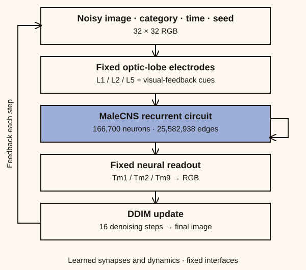
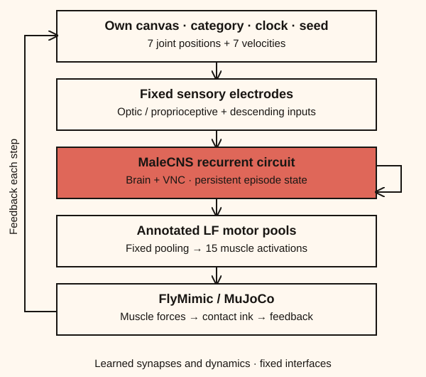

<p align="center">
  
  
</p>

Two recurrent models built from the full MaleCNS connectome: image diffusion and muscle-driven leg painting. Synaptic gains and neuron dynamics are trained; input and output interfaces are fixed.

| Brain Diffusion | Leg Painting |
| --- | --- |
|  |  |

The screenshots below show the previous models. The new circuits are being trained on this feature branch.

| Brain Diffusion | Leg Painting |
| --- | --- |
|  |  |

## Setup

Python 3.12. Run from the repository root.

```sh
python3.12 -m venv .venv
source .venv/bin/activate
pip install -r requirements/paint.txt
```

## Train

```sh
bash scripts/run_brain.sh        # download, prepare, train both tasks, evaluate, export
bash scripts/run_brain.sh image  # image task only
bash scripts/run_brain.sh motor  # muscle task only
```

Jobs run sequentially and use the GPU when available. Rerun to resume. Training reduces the learning rate and stops on validation plateaus, with a default limit of 20,000 steps per task. To extend a run: `bash scripts/run_brain.sh image 40000`.

Data: CIFAR-10 and Quick, Draw!. Checkpoints go in `runs/brain-image/` and `runs/brain-motor/`; portable weights and evaluations go in each run’s `inference/` directory. No pretrained release is available yet.

## App

```sh
python -m flycasso.app --checkpoint runs/brain-image/best.pt \
  --motor-checkpoint runs/brain-motor/best.pt --follow-training
```

Open http://localhost:7860 after both tasks have saved a checkpoint.

Architecture and assumptions: [docs/BRAIN_FIRST.md](docs/BRAIN_FIRST.md). The previous models remain available through `scripts/run.sh`, `scripts/run_motor.sh` and their original checkpoint paths.

## Development

```text
flycasso/     Python models, data preparation, training and inference
scripts/      Training launchers, benchmarks and asset preparation
configs/      Training settings and pinned data sources
requirements/ Python dependencies
web/          Studio UI, assets and vendored Three.js
tests/        Python and JavaScript checks
docs/         Model card, references and screenshots
```

```sh
python -m unittest discover -s tests
node --test tests/*.cjs
python -m scripts.benchmark --help
python -m scripts.benchmark_apple --help
```

The Python checks exercise a small synthetic training run, exact resume, export, HTTP inference, pen contact and Apple GPU gradients. They do not train the full fly to convergence. JavaScript checks require Node.js; the app itself has no Node.js dependency.

Model details: [docs/MODEL_CARD.md](docs/MODEL_CARD.md). Code: [MIT](LICENSE). Data and asset credits: [docs/THIRD_PARTY.md](docs/THIRD_PARTY.md).
