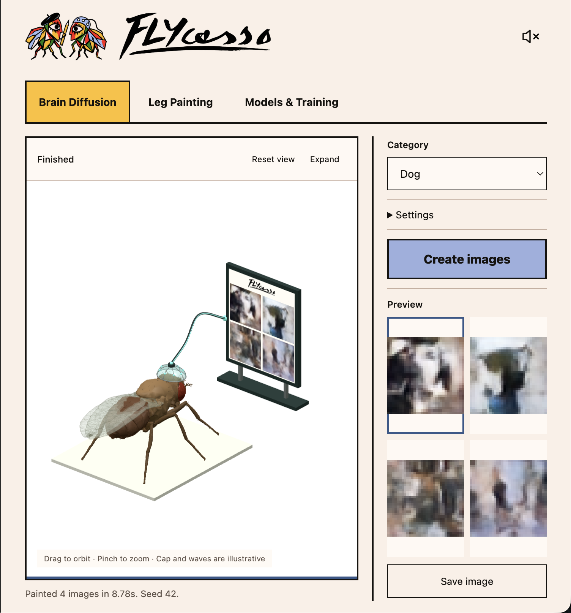
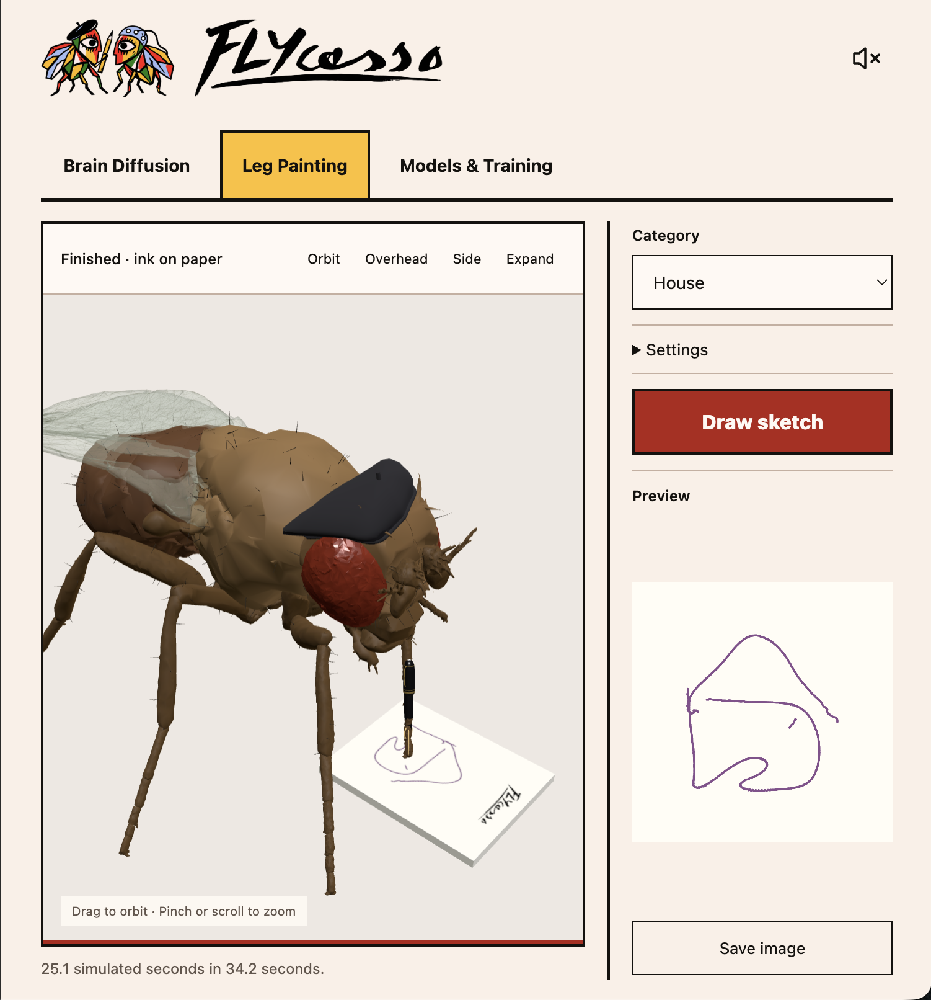
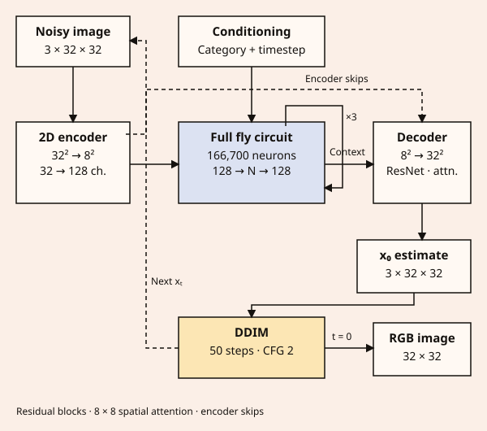
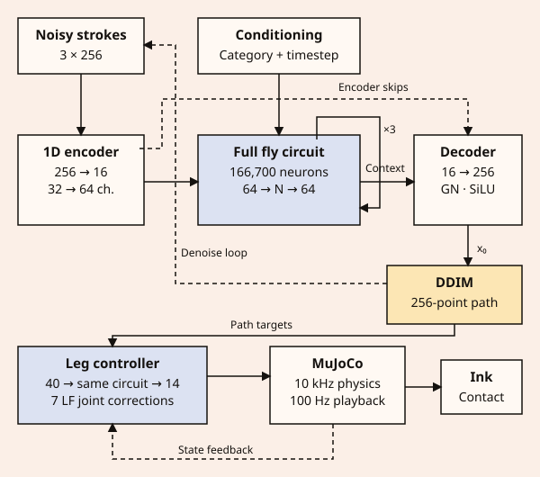

<p align="center">
  
  
</p>

https://github.com/user-attachments/assets/bf8b890b-1dcc-4cfe-9007-10d22dba9736

Two models built around the full MaleCNS fly connectome: image diffusion and one-leg drawing. Both take a category as input. Diffusion learns CIFAR-10 color images; drawing learns Quick, Draw! strokes.

## Setup

Python 3.12. Run from the repository root.

```sh
python3.12 -m venv .venv
source .venv/bin/activate
pip install -r requirements/paint.txt
```

## Train

```sh
bash scripts/run.sh        # diffusion: download, train, evaluate, export
bash scripts/run_motor.sh  # category drawing: download, train, evaluate, export
```

Training uses the GPU when available. Painting first learns pen control, then stroke generation. Weights are generated locally; no pretrained release is available yet.

Rerun the same command to resume interrupted training. Both diffusion loops reduce their learning rate and stop on validation plateaus; stroke generation runs at least 30,000 steps. Inference bundles and evaluation results go in each run's `inference/` directory.

## App

After training has saved a checkpoint:

```sh
python -m flycasso.app --checkpoint runs/diffusion/best.pt --follow-training
```

Open http://localhost:7860. The app has diffusion, pen painting and training tabs.

| Brain Diffusion | Leg Painting |
| --- | --- |
|  |  |

## Architecture

| Brain Diffusion | Leg Painting |
| --- | --- |
|  |  |

## Development

```text
flycasso/     Python models, data preparation, training and inference
scripts/      Training launchers, benchmarks and asset preparation
configs/      Training settings and pinned data sources
requirements/ Python dependencies
web/          Studio UI, assets and vendored Three.js
tests/        Python and JavaScript checks
docs/         Model card, references and screenshots
```

```sh
python -m unittest discover -s tests
node --test tests/*.cjs
python -m scripts.benchmark --help
python -m scripts.benchmark_apple --help
```

The Python checks exercise a small synthetic training run, exact resume, export, HTTP inference, pen contact and Apple GPU gradients. They do not train the full fly to convergence. JavaScript checks require Node.js; the app itself has no Node.js dependency.

Model details: [docs/MODEL_CARD.md](docs/MODEL_CARD.md). Code: [MIT](LICENSE). Data and asset credits: [docs/THIRD_PARTY.md](docs/THIRD_PARTY.md).
