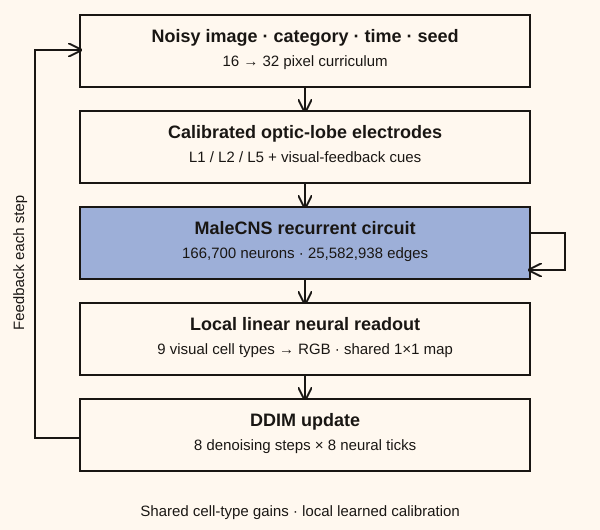
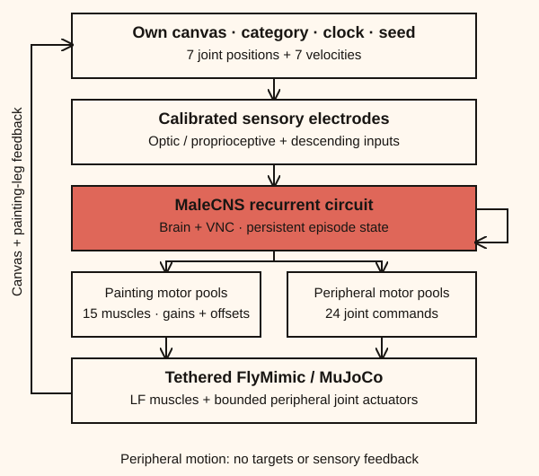

# Circuit-first models

Stopped at user request on 2026-09-13. Image training stopped at saved step 144 in the three-image overfit stage; motor training stopped at step 544 in the hold stage. Neither passed its first curriculum gate. Code and local checkpoints are preserved for possible future experiments. Original models remain on `main`.

```sh
bash scripts/train_calibrated.sh
python -m flycasso.app --checkpoint runs/calibrated-image/best.pt \
  --motor-checkpoint runs/calibrated-motor/best.pt --follow-training
```

The launcher prepares MaleCNS, CIFAR-10, Quick Draw strokes and independent evaluation classifiers. It alternates the two training processes to limit GPU memory use. Each slice saves optimizer state, EMA weights, random state and curriculum progress. Set `FLYCASSO_DEVICE=mps` to require Apple GPU acceleration. Run `python -m flycasso.train_calibrated image --updates 8` or `motor --updates 32` for a single resumable slice.

## Circuit

Each model retains **166,700 neurons and 25,582,938 directed connections**, with independent task weights. Anatomical topology and signs stay fixed. Connections share learned positive gains by ordered cell-type pair: 3,868,258 gains. Bias and leak parameters share 11,781 cell-type groups. Missing type annotations fall back to subclass, superclass, then unknown. Gains range from approximately 0.05 to 20 times the normalized anatomical prior.

The recurrent rate state persists throughout an image or painting episode. Eight neural updates run per denoising step or motor action. Task-specific local adapters calibrate the interfaces; there is no image generator or stroke planner bypassing the circuit. These dynamics, gains and electrodes are engineered models, not recovered physiological weights.

## Brain diffusion



A shared RGB 1×1 calibration drives annotated L1/L2/L5 columns. A 16-channel linear adapter maps category, clock and random cues onto visual-centrifugal electrodes. Nine local populations—Tm1, Tm2, Tm9, C3, Mi1, T1, Mi9, Mi4 and Tm20—feed a shared, bias-free 9→3 linear readout. Total trainable interface size: **311 parameters**. No direct image skip bypasses the circuit.

Training predicts clean pixels with uniform x₀ MSE across eight denoising steps. Unlike the previous recipe, high-noise steps are not almost discarded. Ten percent category dropout supports classifier-free guidance; its default scale remains 1 until conditioning is established. Conditional and unconditional sampling retain separate neural states. Training gradually mixes generated denoising states into its inputs, up to 50%. Backpropagation spans two denoising steps; state persists beyond the gradient window.

Curriculum:

1. Overfit three CIFAR-10 examples at 16×16: airplane, automobile and frog.
2. Train 512 examples per category for those three categories at 16×16.
3. Train all ten categories at 16×16.
4. Train all ten categories at 32×32.

The first gate requires generated-target MSE below 0.035, distinct outputs for different categories with identical noise, and worse reconstruction when recurrent edges are disabled. Later gates require independent CIFAR classifier accuracy above 60% on fresh generated samples, category sensitivity and measurable edge dependence. These small validation samples are development checks; a larger held-out assessment is still required before release.

## Leg painting



Category, clock, variation code, the fly's own canvas and 14 proprioceptive channels drive the circuit. Named front-left motor pools feed 15 muscle gains/offsets and the FlyMimic body. There are **328 trainable interface parameters**. The resting muscle command is initialized from an executed physics-teacher hold, rather than giving every muscle the same activation.

Training combines on-policy expert muscle supervision with an actor–critic update from actual MuJoCo pen-position, contact and terminal stroke-overlap rewards. A small privileged critic sees the training goal but is absent at inference. Backpropagation spans eight motor actions. The action mixture begins with 95% teacher assistance; assistance decreases after successful unassisted tracking checks, rather than after a fixed number of steps.

The curriculum advances through hold, touch/lift, line, circle, one sketch, cat variations, three categories and ten categories. Sketch workspace scale grows from 0.045 to 0.09 mm and pen-up clearance is 0.027 mm above the paper. The sketch stages use up to 1,000 training examples per category. Validation sketches come from the separate Quick Draw validation split.

From the variation stage, a small **training-only** variational encoder derives a three-dimensional sketch code. A KL penalty aligns its posterior with a Gaussian prior. Inference samples that prior from the user's seed and receives no reference sketch. Posterior reference reconstruction and prior category generation are evaluated separately; an arbitrary random seed is not treated as the label of a held-out drawing.

Checkpoint selection uses unassisted pen-position error. Stage gates additionally require contact accuracy and rasterized stroke overlap; trajectory stages require a deterioration under edge ablation. Category stages also require independent sketch recognition, with the ink bounding box normalized to the evaluator’s standard crop. Thresholds are explicit in `flycasso/train_calibrated.py` and remain experimental engineering targets.

## Training safeguards

AdamW, circuit regularization, gradient clipping and EMA are used for both tasks. Three consecutive passing checks advance a stage. Sixteen and 32 checks without improvement halve the learning rate; 48 stop the run as `needs_review`. A plateau does not silently count as curriculum completion. Gradients, physical measurements, generated previews and ablations are recorded in each run's metrics. Old `train_brain` and `train_muscle` commands remain for reproducing the previous recipe; do not resume calibrated checkpoints through them.

The app follows each run's best checkpoint and displays curriculum status. The category menu exposes the current training subset. Primitive motor stages are labeled explicitly; they are not category drawing models yet.

## Body and anatomical limits

The painting leg uses 15 FlyMimic muscle actuators. Split muscle heads share annotated motor pools; individual innervation is unresolved. MaleCNS and FlyMimic come from different specimens. The body is tethered, with only pen–paper collisions enabled.

The studio also reads 24 bounded joint commands from motor populations: three joints in each other leg, neck, abdomen, proboscis, wings, antennae and halteres. Distal segments follow their parents. These extra joints have no task targets or additional sensory feedback; their articulation and gains are engineered approximations. They are not evidence of natural behavior.

Port IDs, cell groups and checksums are in `data/processed/brain-ports-v3/`. Portable inference exports include the calibration artifact and exclude the training-only encoder and critic.

```sh
python -m flycasso.export --checkpoint runs/calibrated-image/best.pt --out bundles/image
python -m flycasso.export --checkpoint runs/calibrated-motor/best.pt --out bundles/motor
```

## Sources

- [MaleCNS](https://male-cns.janelia.org/): connectivity and cell annotations.
- [FlyVis](https://www.nature.com/articles/s41586-024-07939-3): learned connectome-constrained dynamics with shared cell-type parameters and task readouts.
- [FlyGym muscle tutorial](https://neuromechfly.org/tutorials/6_muscle_imitation/): muscle-actuated simulation and imitation training.
- [FlyMimic](https://github.com/gizemozd/FlyMimic): body and motion recordings, distributed through FlyGym.

Upstream licenses remain in `THIRD_PARTY.md`. Training success and biological advantage must be measured; retaining the full graph alone establishes neither.
